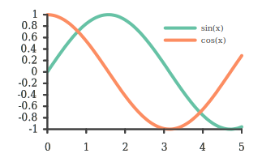
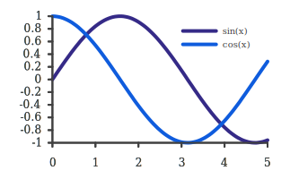

# {: loading=lazy; width=100% }

<!-- # Overview -->

So, you have an amazing C++ application for which you need plotting capabilities. You have searched around and discovered that the available library options for plotting in C++ are rather limited compared to other programming languages, such as Python.

You have now found {{sciplot}}, whose goal is to enable you, C++ programmer, to conveniently produce beautiful plots as easy as in other high-level programming languages!

Here is {{sciplot}} in action:

```c++
#include <sciplot/sciplot.hpp>
using namespace sciplot;

int main(int argc, char** argv)
{
    // Create values for your x-axis
    const vec x = linspace(0.0, 5.0, 100);

    // Create a Figure object
    plot plt;

    // Set color palette
    plt.palette("set2");

    // Draw a sine graph putting x on the x-axis and sin(x) on the y-axis
    plt.drawCurve(x, std::sin(x)).title("sin(x)").linewidth(4);

    // Draw a cosine graph putting x on the x-axis and cos(x) on the y-axis
    plt.drawCurve(x, std::cos(x)).title("cos(x)").linewidth(4);

    // Show the figure in a popup window
    plt.show();

    // Save the figure to a PDF file
    plt.save("figure.pdf");
}
```

After compiling and executing this C++ application, the following figure (`figure.pdf`) is produced:

{: loading=lazy }

Do you want to change the colors?

Simple - just use method `plot::palette` to set your preferred color palette. For example, using `plt.palette("parula")` in the previous code sets the [parula](https://www.mathworks.com/help/matlab/ref/parula.html) color scheme and produces the following figure:

{: loading=lazy }

All available color palettes and their names can be found [here][gnuplot-palettes]. Many thanks to [Anna Schneider][AnnaSchneider] for this incredible work of art!

[gnuplot-palettes]: https://github.com/sciplot/gnuplot-palettes
[AnnaSchneider]: https://github.com/aschn
